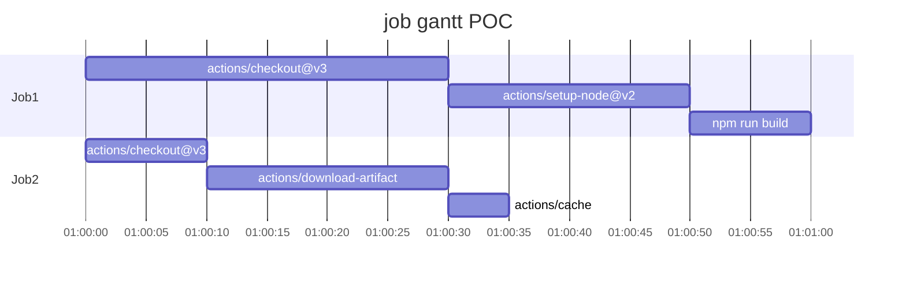

```mermaid
gantt
    title job gantt POC
    dateFormat  HH:mm:ss
    axisFormat  %H:%M:%S
    section Job1
    actions/checkout@v3 :Job1-1, 01:00:00, 30s
    actions/setup-node@v2 :Job1-2, after Job1-1, 20s
    npm run build :Job1-3, after Job1-2, 10s
    section Job2
    actions/checkout@v3 :Job2-1, 01:00:00, 10s
    actions/download-artifact :Job2-2, after Job2-1, 20s
    actions/cache :Job2-3, after Job2-2, 5s
```
