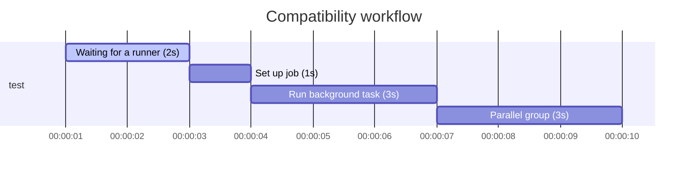

```mermaid
gantt
title Compatibility workflow
dateFormat  HH:mm:ss
axisFormat  %H:%M:%S
section test
Waiting for a runner (2s) :active, job0-0, 00:00:01, 2s
Set up job (1s) :job0-1, after job0-0, 1s
Run background task (3s) :job0-2, after job0-1, 3s
Parallel group (3s) :job0-3, after job0-2, 3s
```
